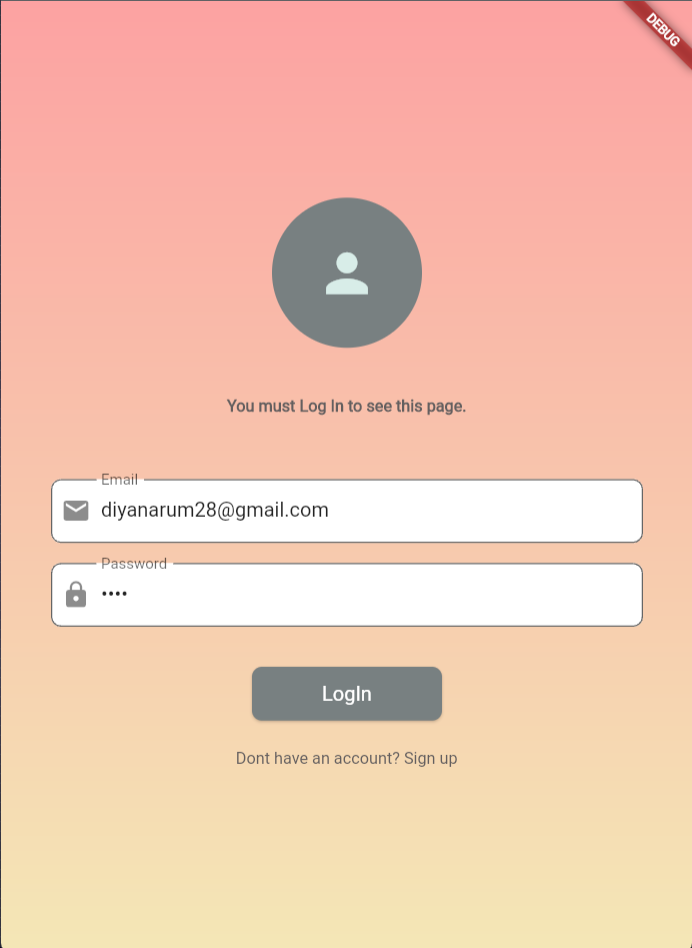
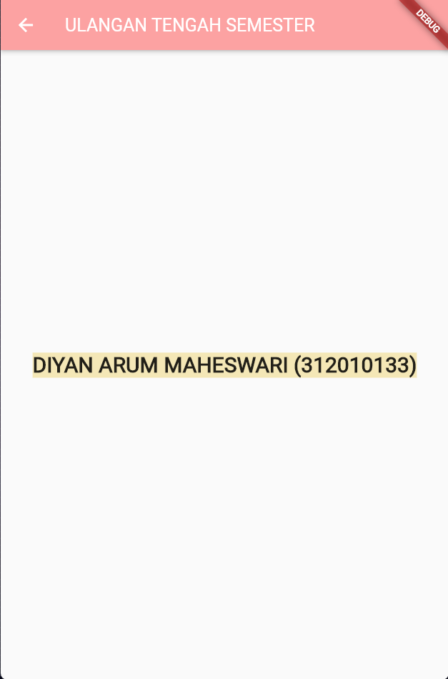

# ULANGAN TENGAH SEMESTER
### NAMA  : DIYAN ARUM MAHESWARI
### KELAS : TI. 20. A. 1
### NIM   : 312010133
_____________________________________________________________________________________________________________________
Di Ulangan Tengah Semester ini, saya diberikan sebuah tugas yaitu :

MEMBUAT SEBUAH TAMPILAN MENU LOGIN MENGGUNAKAN FLUTTER

### **Berikut hasil output dari tugas yang telah saya kerjakan.**

### **1. REGISTRASI ATAU SIGN UP**

Sebelum melakukan Log In di sebuah aplikasi yang baru kita gunakan, biasanya kita diminta untuk mendaftarkan diri terlebih dahulu. Setelah berhasil mendaftar atau registrasi, selanjutnya adalah kita melakukan Log In dengan akun yang tadi kita daftarkan.

### **2. LOG IN**

Setelah memastikan bahwa data yang dimasukan sudah sesuai dengan yang didaftarkan sebelumnya. Selanjutnya, tekanlah tombol Log In dan kemudian jika berhasil kalian akan dibawa ke sebuah halaman isi seperti dibawah ini.

### **3. NOTE PAGE**

  ###   === THANKS FOR YOUR ATTENTION!!! ===
  ### == DIYAN ARUM MAHESWARI - 312010133 ==